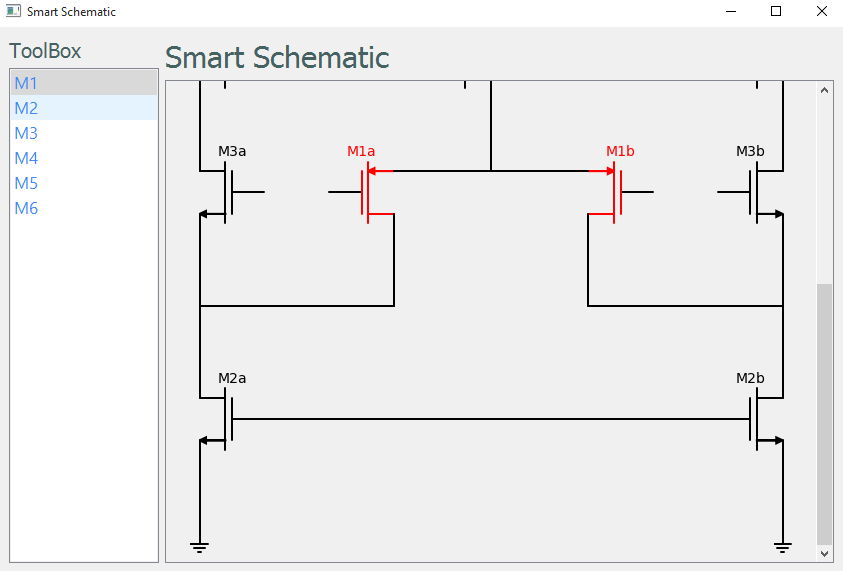

# Smart Schematic

### A Python GUI changing the color of mosfets selected from the tool box. The main idea is to save the image and load it in the app
and once selecting new item we remove the old view and replace it with the new one

## Features
1 - Creating Custom object from scemdraw (NMOS)
 
2 - Creating Custom object from scemdraw (PMOS)

## Preview

  schematic saved from the app
   
  
   
  
   
  change the color of selected mosfet
   
  
   
  
   

